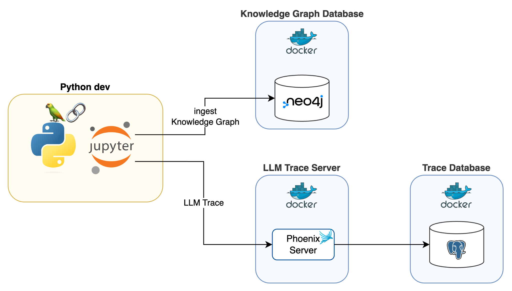

<!-- @format -->

# Knowledge Graph RAG Tutorial by Langchain

## Overview

<https://python.langchain.com/v0.1/docs/use_cases/graph/>


## Dev



| Service             | Role                                                                 |
| ------------------- | -------------------------------------------------------------------- |
| Jupyter Notebook    | Interface for data analysis and visualization, using Python scripts. |
| Neo4j (Docker)      | Database for storing and managing the knowledge graph.               |
| Phoenix Server      | Server for managing LLM traces, running within a Docker container.   |
| PostgreSQL (Docker) | Database for storing trace data.                                     |

## Setup

### .env

```shell
NEO4J_URI=bolt://localhost:7687
NEO4J_USERNAME=xxx
NEO4J_PASSWORD=xxxx

POSTGRES_USER=xxx
POSTGRES_PASSWORD=xxx
POSTGRES_DB=xxx

AZURE_OPENAI_ENDPOINT=https://xxx.openai.azure.com/
OPENAI_API_VERSION=2024-02-01
AZURE_OPENAI_API_KEY=xxxxx

PHOENIX_COLLECTOR_ENDPOINT=http://0.0.0.0:6006
```

| Environment Variable         | Description                                         |
| ---------------------------- | --------------------------------------------------- |
| `NEO4J_URI`                  | The URI to connect to the Neo4j database.           |
| `NEO4J_USERNAME`             | The username for Neo4j authentication.              |
| `NEO4J_PASSWORD`             | The password for Neo4j authentication.              |
| `POSTGRES_USER`              | The username for the PostgreSQL database.           |
| `POSTGRES_PASSWORD`          | The password for the PostgreSQL database.           |
| `POSTGRES_DB`                | The name of the PostgreSQL database.                |
| `AZURE_OPENAI_ENDPOINT`      | The endpoint for the Azure OpenAI service.          |
| `OPENAI_API_VERSION`         | The version of the OpenAI API to use.               |
| `AZURE_OPENAI_API_KEY`       | The API key for accessing Azure OpenAI.             |
| `PHOENIX_COLLECTOR_ENDPOINT` | The endpoint where traces and evaluations are sent. |
